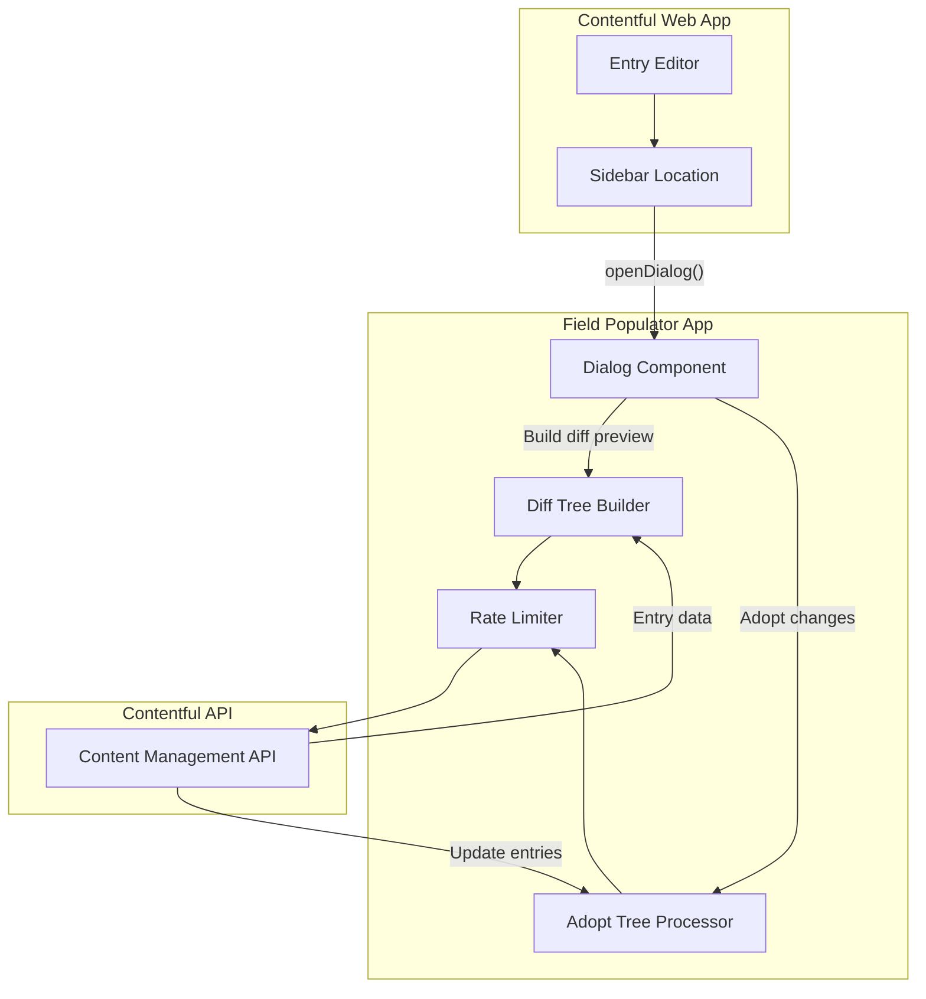
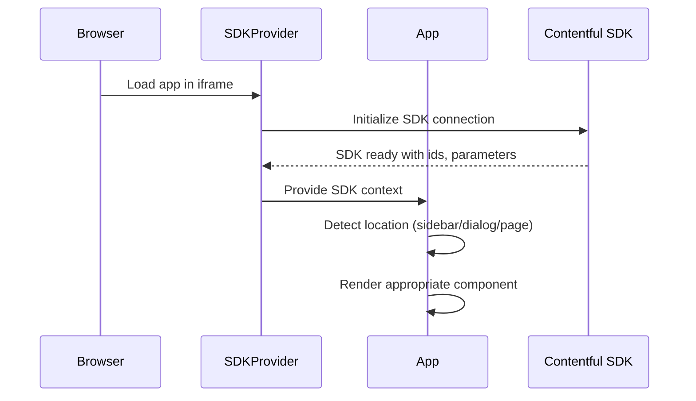
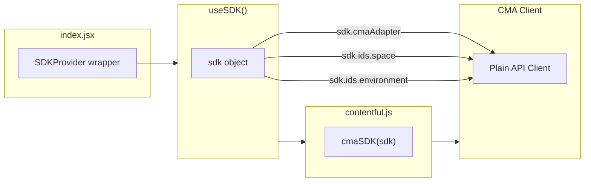
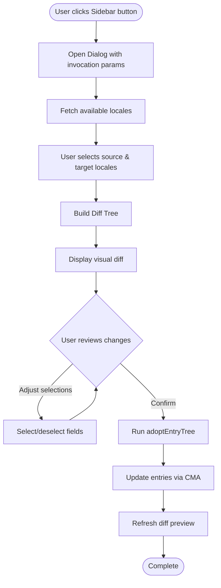
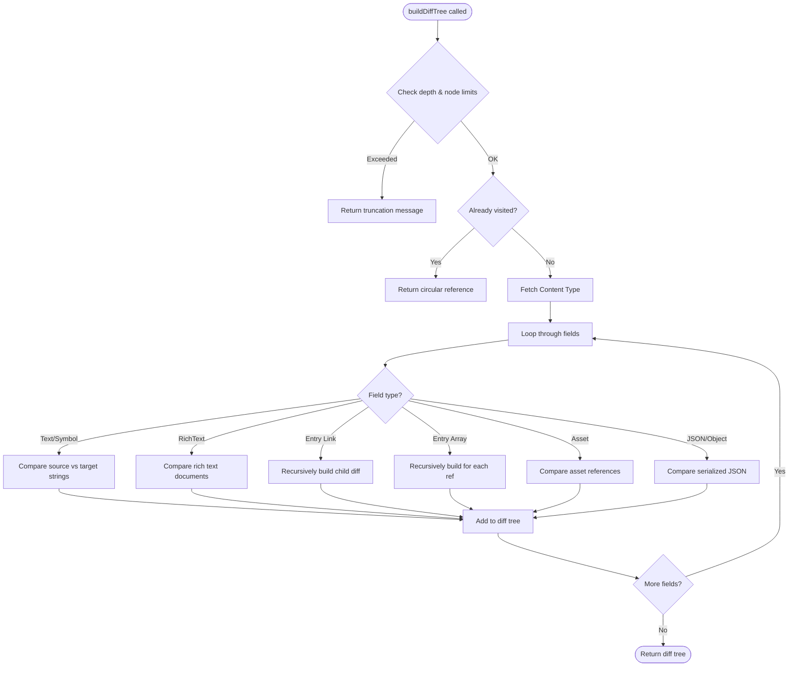
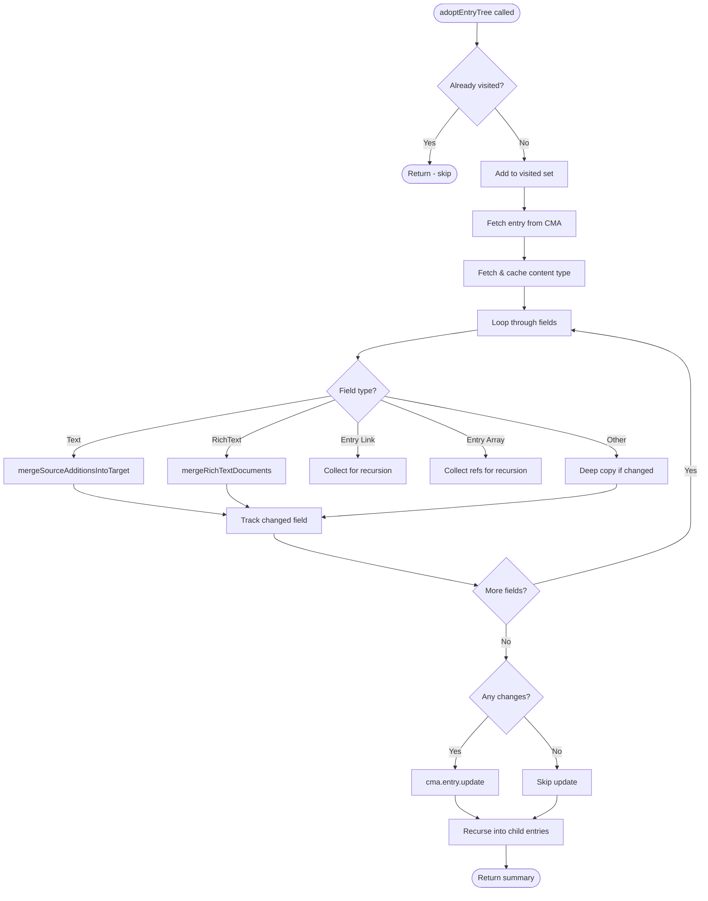
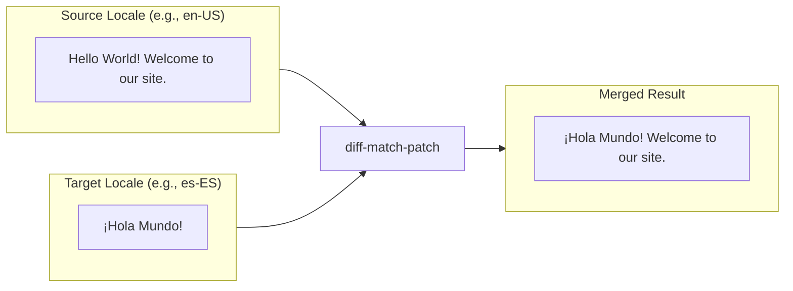
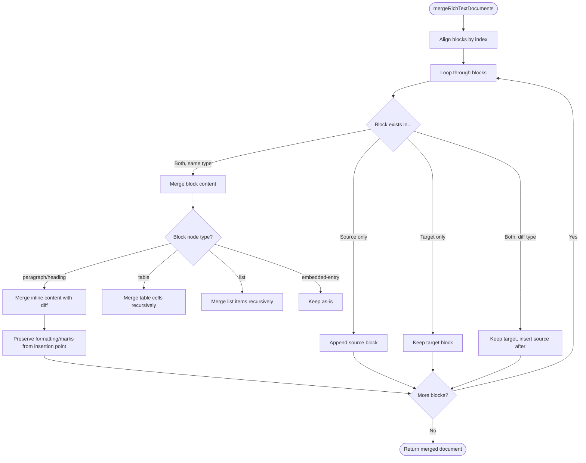
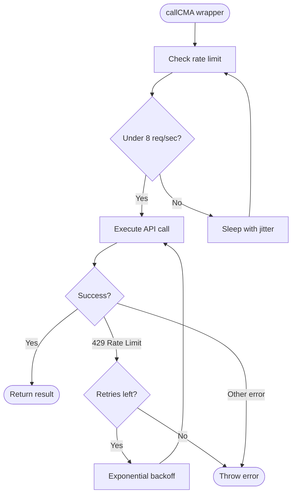
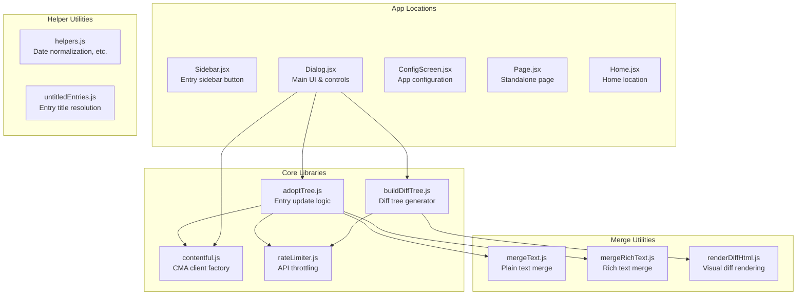

# Field Populator (Locale Adopter) - Logic Flow

A Contentful App that propagates localized content from a source locale to one or more target locales, using an **insert-only merge strategy** that preserves existing translations.

---

## High-Level Architecture

---

## App Initialization Flow

---

## SDK Connection Details

The `cmaSDK()` function creates a Contentful Management API client:
- Uses **sdk.cmaAdapter** for authentication (no API keys needed)
- Sets default **spaceId** and **environmentId** from `sdk.ids`
- Prefers **environmentAlias** over raw environment ID when available

---

## Dialog Workflow

---

## Diff Tree Building

### Safety Controls
- **maxDepth**: Limits recursion depth (default: 4)
- **maxNodes**: Hard cap on total entries traversed (default: 250)
- **visited Set**: Prevents infinite loops from circular references

---

## Adoption (Entry Update) Flow

---

## Insert-Only Merge Strategy

The app uses an **insert-only** approach to preserve existing translations:

### Merge Rules

| Diff Operation | Meaning | Action |
|----------------|---------|--------|
| **EQUAL** (0) | Text exists in both | Keep target text |
| **INSERT** (+1) | Text in source, missing in target | **Insert** at correct position |
| **DELETE** (-1) | Text in target, missing in source | **Keep** target (never delete) |

---

## Rich Text Merge Flow

---

## Rate Limiting

### Rate Limiter Settings
- **maxPerSecond**: 8 requests/second (under Contentful's 10/sec limit)
- **jitterMs**: 20-25ms random jitter to prevent thundering herd
- **retries**: 4 attempts with exponential backoff on 429 errors

---

## Component & File Structure

---

## Key Design Decisions

1. **Insert-only merging**: Never deletes target content, only adds missing content from source
2. **Recursive traversal**: Follows entry references to update linked content
3. **Position-aware insertion**: New content inserted at semantically correct positions
4. **Formatting preservation**: Inserted text inherits marks/styling from insertion point
5. **Rate limiting**: Stays under Contentful API limits with automatic retry
6. **Traversal limits**: Prevents runaway recursion with depth/node caps
7. **Optimistic locking**: Uses entry versions to prevent overwriting concurrent edits
